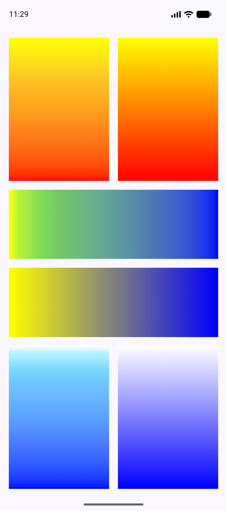

# Vibrance

Natural color mixing for Kotlin and Compose Multiplatform.

Using this library you can mix (or interpolate) sRGB colors as real-world paints. This process
creates a different path between the source and destination colors. The screenshot belows compares
gradients generated by this library to gradients produced by Compose out of the box. In each pair,
the left or top gradient was generated by Vibrance, and the right or bottom gradient was generated
by Compose:

# License

This library is available under Apache 2.0. See [LICENSE](./LICENSE).
