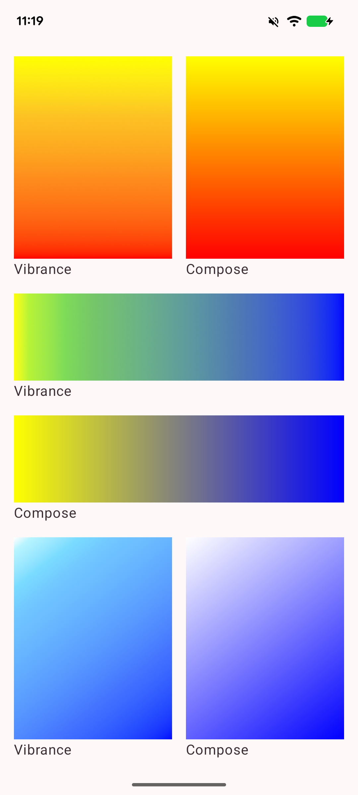

# Vibrance

Natural color mixing for Kotlin and Compose Multiplatform.

Using this library you can mix (or interpolate) sRGB colors as real-world paints. This process creates a different path between the source and destination colors, replicating subtractive color mixing.

The screenshot below compares gradients generated by this library to gradients produced by Compose out of the box. In each pair, the left or top gradient was generated by Vibrance, and the right or bottom gradient was generated by Compose:



## Features

- **Subtractive color mixing**: Interpolates sRGB colors by converting them to a latent color space
  representing pigment concentrations (Phthalo Blue, Quinacridone Magenta, Hansa Yellow, and
  Titanium White).
- **Kotlin Multiplatform**: Supports Android, JVM, iOS, macOS, JS, and Wasm.
- **Jetpack Compose / Compose Multiplatform Support**: Provides easy-to-use Compose APIs, including
  modifiers for adding paint-mixed gradients:
  - Vertical gradients
  - Horizontal gradients
  - Directional gradients
  - Radial gradients
  - Sweep gradients

## Dependencies

> [!WARNING]
> Vibrance is not published yet. Stay tuned!

Add the following to your `build.gradle.kts`:

```kotlin
dependencies {
    // For core color mixing logic
    implementation("dev.romainguy:vibrance:0.x.0")

    // For Compose APIs
    implementation("dev.romainguy:vibrance-compose:0.x.0")
}
```

## Usage

### Core library (`vibrance`)

The `Vibrance` class is the main entry point to mix colors. You can mix sRGB colors directly, or for
performance-critical scenarios like animations, you can mix colors in the latent space.

```kotlin
import dev.romainguy.vibrance.Vibrance

val vibrance = Vibrance()

// 1. Direct color mixing
// Mix blue and yellow by 25% (amount is between 0.0f and 1.0f)
val color = vibrance.colorsMix(
    srcR = 0.0f, srcG = 0.0f, srcB = 1.0f, // Blue
    dstR = 0.0f, dstG = 1.0f, dstB = 1.0f, // Yellow
    amount = 0.25f
)

// 2. Optimized mixing via latent colors
// Upscaling to latent color space is the most expensive operation.
// If you are interpolating frequently, pre-compute the latent colors.
val latentBlue = vibrance.colorToLatentColor(0.0f, 0.0f, 1.0f)
val latentYellow = vibrance.colorToLatentColor(0.0f, 1.0f, 1.0f)

// Interpolate the latent colors, which is much faster
val color = vibrance.latentColorsMix(latentBlue, latentYellow, 0.25f)
```

You can also explicitly supply an array of floats to prevent allocations:

```kotlin
val latentBlue = FloatArray(6)
vibrance.colorToLatentColor(0.0f, 0.0f, 1.0f, latentBlue)
```

### Jetpack Compose (`vibrance-compose`)

#### Gradients

If you are using Jetpack Compose or Compose Multiplatform, you can easily create natural gradients
using the provided modifiers:

```kotlin
import androidx.compose.ui.Modifier
import androidx.compose.ui.graphics.Color
import dev.romainguy.vibrance.compose.horizontalPaintGradient
import dev.romainguy.vibrance.compose.verticalPaintGradient

// Vertical paint gradient from Blue to Yellow
Column(Modifier
    .fillMaxSize()
    .verticalPigmentsGradient(
        startColor = Color.Blue,
        endColor = Color.Yellow
    )
) {
    // ...
}

// Horizontal paint gradient from Red to Green
Row(Modifier
    .fillMaxWidth()
    .horizontalPigmentsGradient(
        startColor = Color.Red,
        endColor = Color.Green
    )
) {
    // ...
}
```

Here are all the available gradient modifiers:
- `horizontalPigmentsGradient`
- `verticalPigmentsGradient`
- `linearPigmentsGradient`
- `radialPigmentsGradient`
- `sweepPigmentsGradient`

All gradient types except sweep gradients support the following tile modes:
- `TileMode.Clamp`: default behavior, hold the start/end colors outside its bounds.
- `TileMode.Repeated`: restarts the gradient outside its bounds.
- `TileMode.Mirror`: repeats and mirrors the gradient outside its bounds.
- `TileMode.Decal`: output fully transparent pixels outside the gradient bounds.

#### Colors

The `vibrance-compose` module adds a series of extensions to the `Vibrance` class that accept and
return `androidx.compose.ui.graphics.Color` types instead of raw `Float` values.

## License

This library is available under Apache 2.0. See [LICENSE](./LICENSE).
