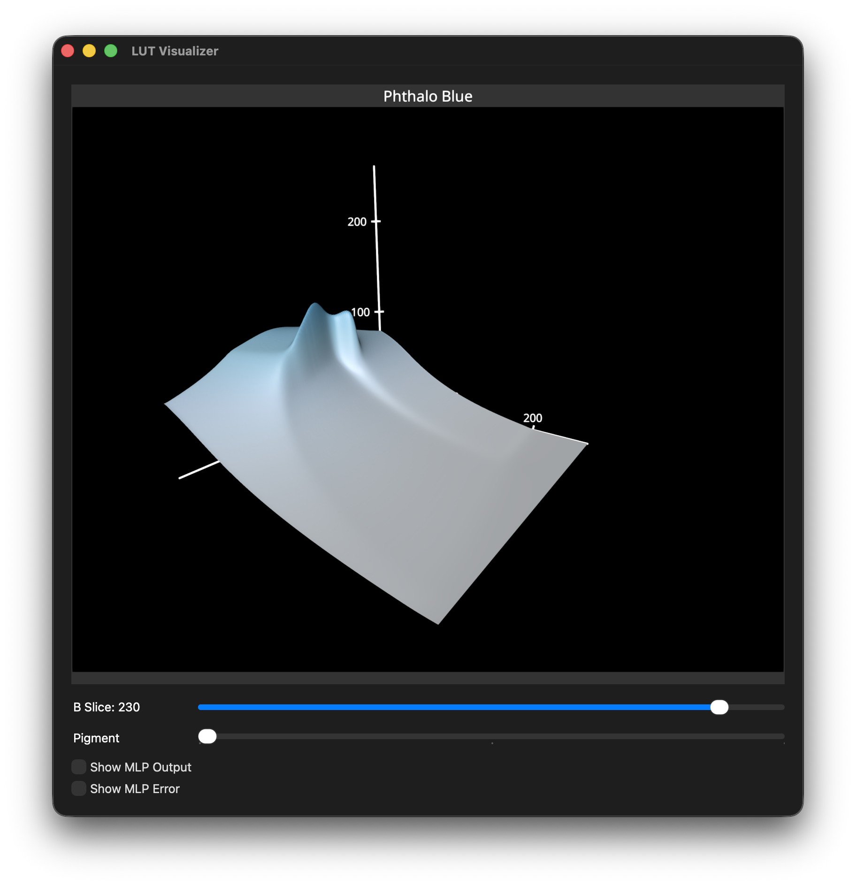
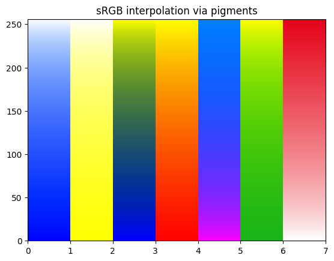

# Vibrance Scripts

This folder contains a series of Python scripts and Jupyter notebooks used to generate
the data used by the vibrance library. These scripts are designed to be used in a
certain order to generate and refine the data.

## Configuration Files

The scripts used two different configuration files:
- `data_config.json`: Stores the paths for the various files read/generated by the scripts.
- `config.json`: Configuration for `pigments.py`. See the documentation of `PigmentsConfig`
  for more information about the different options.

## Prepaing the Execution Environment

To install all the necessary dependencies for the scripts mentioned below, you can run
`create_venv.sh`. This will create a Python virtual environment in `.venv` that you will
need to activate to use.

## 1. Pigments Optimization

The reflectance and absorption data stored in the CSV files in `data/` is measured directly
from real-world paints. Using this data directly would however produce out-of-gamut colors
when going from a pigments mixture to sRGB. To address this, we can run an optimization
process that modifies the pigments to guarantee that the generated RGB colors fall inside
the sRGB gamut.

To run this optimization process:
- Set `use_optimized_pigments` to `false` in `config.json`.
- Run `pigments_optimization.py`.
- Set `use_optimized_pigments` to `true` in `config.json`.

## 2. Un-mixing Lookup Table

Unmixing an RGB color into a series of pigment concentrations is a fairly expensive process.
To avoid expensive computation, we can generate a 3D LUT that maps all 8-bit sRGB values
to pigment concentrations.

The generated 3D LUT has the following properties:
- Stored as a Numpy serialized array in `data/pigments_lut_256_fp16.npy`.
- Dimensions: 256x256x256x3.
- Data type: float16.
- Each entry contains 3 concentrations. The 4th is implicit since the sum of concentrations
  must equal 1. The last concentration is computed after sampling the LUT.
- The concentrations are in the following order: "blue", "magenta", "yellow". This order
  is defined by the reflectance/absorption data in the CSV files.
- The generated file is ~100 MiB on disk.

To generate the 3D LUT run `unmix_lut.py`.

> [!CAUTION]
> The LUT generation process is designed to run on the GPU and can take several minutes to
> complete on a 40-core GPU on a MacBook Pro M5 Max. The process supports Apple Silicon and
> CUDA environments. If no suitable environment is found, the process will run on the CPU,
> and can take several hours to complete.

## 3. Training the Multi-Layer Perceptron

The LUT is too large (100 MiB in fp16, 50 MiB in uint8) for our purpose, a library for
mobile apps. We could downsample the LUT to 33x33x33, and store it in uint8; this would
require only ~105 KiB, at the cost of precision.

Instead, we train a small MLP to approximate our 3D LUT numerically. This MLP consists
of 3 layers of 32 neurons, using 4 frequency bands for its positional encoding, for a
total of 2,051 parameters.

The Kotlin inference of our small MLP takes ~30µs on a MacBook Pro M5 Max
(single-threaded), in cold execution (no AOT/JIT/etc.).

To train the MLP:
- Generate the 3D LUT as explained in the previous section.
- Run `smooth_lut.py` to apply a small Gaussian filter to a select portion of the dataset.
  Training can proceed without this step, but it will yield large errors for some of the
  input colors when the blue component (Z coordinate in the LUT) is >220 (or 0.86 in the
  0..1 range).
- Run `mlp.py train` to start the training process.

> [!NOTE]
> The trained MLP will be exported in two formats in the `data/` directory: as a pair of
> ONNX files, and as a single JSON file.

> [!CAUTION]
> The MLP training process is designed to run on the GPU and can take several minutes to
> complete on a 40-core GPU on a MacBook Pro M5 Max.

## 4. Testing the MLP

To quickly test the trained MLP you can use the same Pyton script: `mlp.py query R G B`.

Where R, G, and B are values in the 0..255 range. The script will comapre the output of the
MLP with the ground truth from the 3D LUT.

> [!TIP]
> The output values straight from the MLP may be slightly out of the 0..1 range. It is
> recommended to clamp/saturate them.

You can also visualize the MLP and compare it to the 3D LUT by running `viewer.py`.
The UI has several controls:
- A slider to select which of the 3 pigments to visualize.
- A slider to select the blue slice in the 3D LUT.
- A checkbox to show the MLP or the 3D LUT.
- A checkbox to display the absolute error between the MLP and the 3D LUT.

## 5. Converting the MLP to Kotlin

The script `model_json_to_kt.py` converts the JSON export of the MLP to a Kotlin source
file, called `test/PigmentsModelWeights.kt` by default. This file stores the weights and
biases of the model as flat arrays of float directly in a Kotlin object to remove the need
to parse a file at runtime.

## 6. Downsampling and Converting the 3D LUT

If using a lookup table is more desirable than running an LMP, you can use the script
`lut_to_png.py` to conver the Numpy LUT to a PNG file. By default, the generated PNG
will encode a 33x33x33 LUT, where all the Z slices are stored side-by-side. You can pass
the desired size as a parameter to the script. For instance, `lut_to_png.py 65` to
generate a 65x65x65 LUT.

> [!NOTE]
> This script will also downsample the stored values (the concentrations) from fp16 to
> uint8, encurring a loss of precision in the process.

## 7. Jupyter Notebook

The notebook in `Paint Mixing.ipynb` was the original implementation of the scripts
detailed above. It nows contains a simple visualization of various color ramps through
the pigments mixing process.

